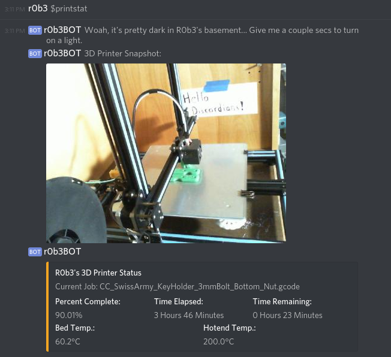

*** This project lives @ https://gitlab.rickelobe.com/Bots/R0b3BOT ***

# Screenshot

# Description
This is R0b3's Discord Bot.  It's creation was basically a challenge posed a coworker who said "Hey, you can write Discord Bots in Python... Make one to display your 3D printer status!".

# Requirements
1. discord.py version 1.2.4 or greater 
    <code> python3 -m pip install -U https://github.com/Rapptz/discord.py/archive/rewrite.zip </code>
2. homeassistant API 
    <code> pip install homeassistant</code>  

# Configuration
1. Create a Discord Bot via Developer tools 
2. Enter various configuration parameters in bot_config.conf.example 
3. Enter OctoPrint config parameters in octoapi.conf.example 
4. Rename *.example files as *.conf 