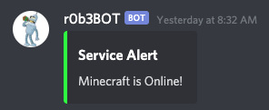
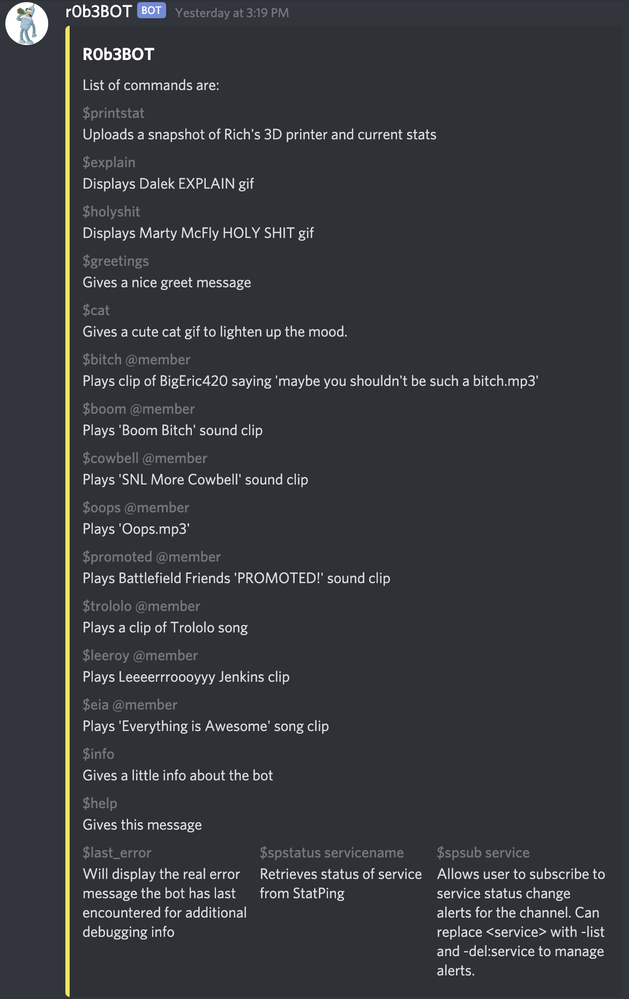

*** This project lives @ https://gitlab.rickelobe.com/Bots/R0b3BOT ***

# Description
This is R0b3's Discord Bot.  It's creation was basically a challenge posed a coworker who said "Hey, you can write Discord Bots in Python... Make one to display your 3D printer status!".  But as time went on, a few more features were added.  Aside from being able to query and monitor your 3D printer, it can also fetch the current status of a service monitroed by your [StatPing](https://github.com/statping/statping) instance.  In addition to just fetching the current status of a service, you can subscribe to receive alerts for any StatPing service state change.  All subscriptions are persistent and will remain even after the bot is restarted.

# Features
*  Query & Monitor 3D Printer Status using `$printstat` command(Requires that your printer is connected to [Octoprint](https://octoprint.org/)) 

*  Query serivces states on StatPing using the `$spstatus`
*  Use `$spsub` to "Subscribe" to service change alerts for StatPing services.  Subscribed alerts are persistent and are not lost on bot restart. 

*  Play a selection of sound clips to voice channel members using the various commands (`$torololo`, `$oops`, `$promoted`, etc)

# Commands

# Requirements
1. discord.py version 1.2.4 or greater 
    <code> pip install discord.py </code>

# Configuration
1. Create a Discord Bot via Developer tools 
2. Enter configuration parameters in bot_config.conf.example 
3. Enter OctoPrint config parameters in octoapi.conf.example 
4. Rename *.example files as *.conf 